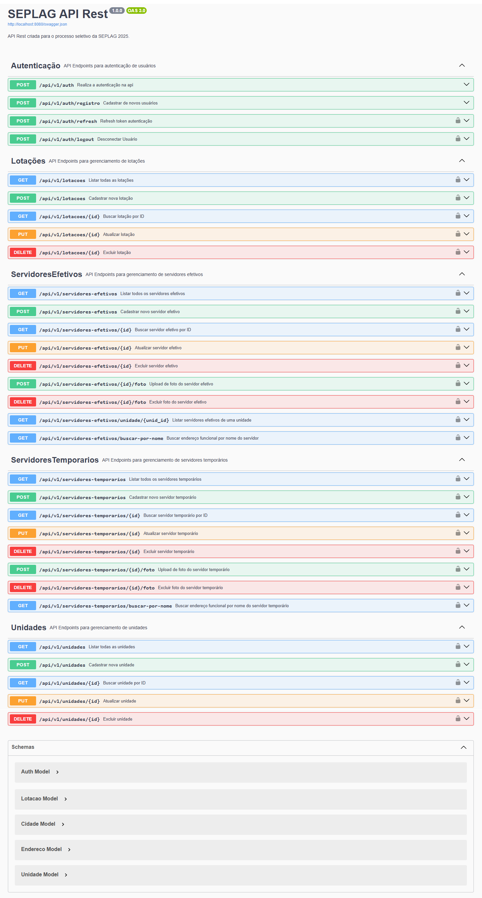

# Processo Seletivo SEPLAG - PHP

Para o projeto do seletivo, foi escolhido o framework CodeIgniter 4.6.0 para a construção da API REST, seguindo o padrão MVC. A autenticação é implementada com JWT (JSON Web Token) para garantir segurança no acesso, e o Swagger é utilizado para facilitar a documentação e os testes da API.

## 👨🏻‍💻 Desenvolvedor

```sh
Nome: Eduardo Marcos Fiorini
Inscrição: 7838
E-mail: edupva@gmail.com
```

## 📦 Instalação (Deploy)

```sh
# Use o comando abaixo para clonar o repositório.
$ git clone https://github.com/eduardofiorini/SEPLAG-PHP-Seletivo.git
$ cd SEPLAG-PHP-Seletivo

# Caso não tenha o Docker Compose, preciosa ser instalado.
sudo curl -L "https://github.com/docker/compose/releases/download/1.29.2/docker-compose-$(uname -s)-$(uname -m)" -o /usr/local/bin/docker-compose
sudo chmod +x /usr/local/bin/docker-compose
docker-compose --version

# Para facilitar o deploy foi criado um setup de instalação e configuração do projeto.
chmod +x setup.sh && ./setup.sh
```

## 📌 Implementações (Tasks)

As prioridades do projeto estão listadas abaixo na ordem crescente: 

- ✅ Criação do Repositório - [24/03/2025 - Commit c85ebc5](https://github.com/eduardofiorini/SEPLAG-PHP-Seletivo/commit/c85ebc56a261e3be241ca21432f6d19f9fa1737a)
- ✅ Implementar Framework - [27/03/2025 - Commit 56e28dd](https://github.com/eduardofiorini/SEPLAG-PHP-Seletivo/commit/56e28ddfdb82723cdf6d95bbc6293ab499f17180)
- ✅ Implementar Migrations - [28/03/2025 - Commit 391c755](https://github.com/eduardofiorini/SEPLAG-PHP-Seletivo/commit/391c7559033100ebb184d32f5dfe207d397d552a)
- ✅ Implementar Models - [28/03/2025 - Commit 062c821](https://github.com/eduardofiorini/SEPLAG-PHP-Seletivo/commit/062c8216479abaf8a969ca7dc8e2f6931a2b2761)
- ✅ Implementar JWT - [28/03/2025 - Commit 93d4673](https://github.com/eduardofiorini/SEPLAG-PHP-Seletivo/commit/93d467390f6db8019df8e1fe88b53aa85ac872f1)
- ✅ Implementar Validações - [28/03/2025 - Commit 93d4673](https://github.com/eduardofiorini/SEPLAG-PHP-Seletivo/commit/93d467390f6db8019df8e1fe88b53aa85ac872f1)
- ✅ Implementar Limitador Request (AntiDDos) - [28/03/2025 - Commit 93d4673](https://github.com/eduardofiorini/SEPLAG-PHP-Seletivo/commit/93d467390f6db8019df8e1fe88b53aa85ac872f1)
- ✅ Implementar Limitador Acesso Externo (Cors) - [28/03/2025 - Commit 93d4673](https://github.com/eduardofiorini/SEPLAG-PHP-Seletivo/commit/93d467390f6db8019df8e1fe88b53aa85ac872f1)
- ✅ Dockerizar Aplicação - [28/03/2025 - Commit 4e19698](https://github.com/eduardofiorini/SEPLAG-PHP-Seletivo/commit/4e19698db4ee77c99b8f66938093fc07ba2640ea)
- ✅ Implementar Swagger - [30/03/2025 - Commit d061c4b](https://github.com/eduardofiorini/SEPLAG-PHP-Seletivo/commit/d061c4b6163c87a95cf24ae835e1845fbb350ba0)
- ✅ Implementar Autenticação - [30/03/2025 - Commit d061c4b](https://github.com/eduardofiorini/SEPLAG-PHP-Seletivo/commit/d061c4b6163c87a95cf24ae835e1845fbb350ba0)
- ✅ Implementar Controllers - [31/03/2025 - Commit 13ce506](https://github.com/eduardofiorini/SEPLAG-PHP-Seletivo/commit/13ce506a7deca304eb13205454eb8f23e74ca1e5)
- ✅ Implementar Rotas - [31/03/2025 - Commit 13ce506](https://github.com/eduardofiorini/SEPLAG-PHP-Seletivo/commit/13ce506a7deca304eb13205454eb8f23e74ca1e5)
- ✅ Implementar CRUD - [31/03/2025 - Commit 13ce506](https://github.com/eduardofiorini/SEPLAG-PHP-Seletivo/commit/13ce506a7deca304eb13205454eb8f23e74ca1e5)
- ✅ Implementar Paginação - [31/03/2025 - Commit 13ce506](https://github.com/eduardofiorini/SEPLAG-PHP-Seletivo/commit/13ce506a7deca304eb13205454eb8f23e74ca1e5)
- ✅ Implementar Upload MinIO - [31/03/2025 - Commit 13ce506](https://github.com/eduardofiorini/SEPLAG-PHP-Seletivo/commit/13ce506a7deca304eb13205454eb8f23e74ca1e5)

## 🛢️ Modelagem Banco de Dados

Na modelagem abaixo não possui uma tabela de autenticação ou usuário, foi criado uma tabela "auth" para homologar o acesso e gerar o token JWT.


## 📚 Documentação / Credencial
```sh
# Api Rest (Swagger)
http://localhost:8080/api/v1/docs
http://localhost:8080/api/v1/docs/generate

Porta: 8080
Usuario: admin@admin.com.br
Senha: Ezm&F7#G5&c2

# Min.IO
Porta: 9000-9001
Usuario: admin
Senha: seplag@123

# PostGreSQL
Porta: 5432
Usuario: seplag
Senha: seplag@123
Banco: seplag_db
```


## 📖 Referências

* <https://jwt.io/introduction>
* <https://docs.min.io/>
* <https://codeigniter.com/user_guide/index.html>
* <https://swagger.io/docs/>
* <https://packagist.org/packages/codeigniter4/framework>
* <https://packagist.org/packages/firebase/php-jwt>
* <https://packagist.org/packages/aws/aws-sdk-php>
* <https://packagist.org/packages/doctrine/annotations>
* <https://packagist.org/packages/zircote/swagger-php>