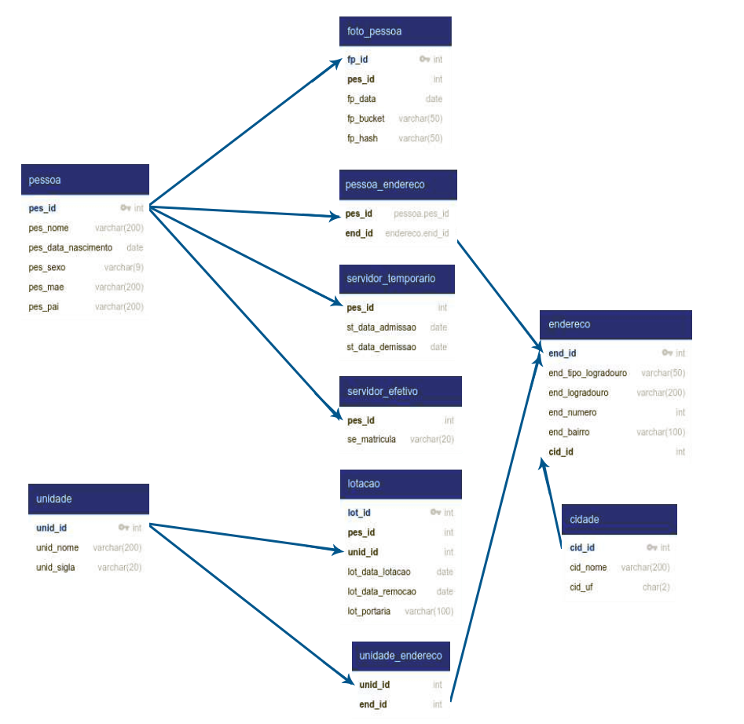

# Processo Seletivo SEPLAG - PHP

Para o projeto do seletivo, foi escolhido o framework CodeIgniter 4.6.0 para a construção da API REST, seguindo o padrão MVC. A autenticação é implementada com JWT (JSON Web Token) para garantir segurança no acesso, e o Swagger é utilizado para facilitar a documentação e os testes da API.

## 👨🏻‍💻 Desenvolvedor

```sh
Nome: Eduardo Marcos Fiorini
Inscrição: 7838
E-mail: edupva@gmail.com
```

## 📦 Instalação

```sh

```

## ⚙️ Configurações
```sh

```

## 📌 Implementações (Tasks)

As prioridades do projeto estão listadas abaixo na ordem crescente: 

- ✅ Criação do Repositório - [24/03/2025 - Commit c85ebc5](https://github.com/eduardofiorini/SEPLAG-PHP-Seletivo/commit/c85ebc56a261e3be241ca21432f6d19f9fa1737a)
- ✅ Implementar Framework - [27/03/2025 - Commit 56e28dd](https://github.com/eduardofiorini/SEPLAG-PHP-Seletivo/commit/56e28ddfdb82723cdf6d95bbc6293ab499f17180)
- ✅ Implementar Migrations - [28/03/2025 - Commit 391c755](https://github.com/eduardofiorini/SEPLAG-PHP-Seletivo/commit/391c7559033100ebb184d32f5dfe207d397d552a)
- ✅ Implementar Models - [28/03/2025 - Commit 062c821](https://github.com/eduardofiorini/SEPLAG-PHP-Seletivo/commit/062c8216479abaf8a969ca7dc8e2f6931a2b2761)
- ✅ Implementar JWT
- ✅ Implementar Validações
- ✅ Implementar Limitador Request (AntiDDos)
- ✅ Implementar Limitador Acesso Externo (Cors)
- ⬛ Implementar Controllers
- ⬛ Implementar Teste Unitário
- ⬛ Implementar Swagger
- ⬛ Implementar Rotas
- ⬛ Implementar CRUD
- ⬛ Implementar Paginação
- ⬛ Implementar Ordenação
- ⬛ Implementar Upload MinIO
- ⬛ Dockerizar Aplicação
- ⬛ Deploy
- ⬛ Finalização

## 🛢️ Modelagem Banco de Dados

Na modelagem abaixo não possui uma tabela de autenticação ou usuário, foi criado uma tabela "auth" para homologar o acesso e gerar o token JWT.



## 📖 Referências

* <https://jwt.io/introduction>
* <https://docs.min.io/>
* <https://github.com/firebase/php-jwt>
* <https://codeigniter.com/user_guide/index.html>
* <https://packagist.org/packages/firebase/php-jwt>